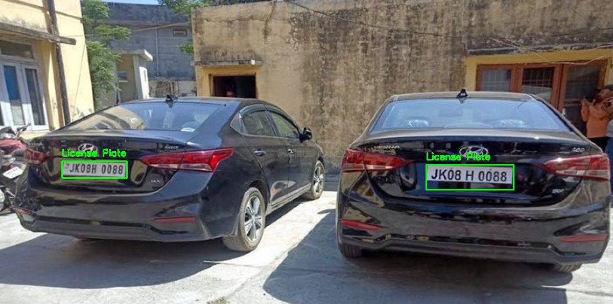

# 🚘 Car Plate Detector

A deep learning-based web application that detects and extracts vehicle license plates from images. This tool can be used in applications like parking systems, security cameras, and traffic monitoring.

---

## 📸 Demo

  
*Detecting license plates from real-world images.*

---

## ✨ Features

- 🔍 Automatic car number plate detection using OpenCV & machine learning
- 📤 Upload image and detect plates in real-time
- 🧠 Trained on publicly available datasets
- 🖼️ Output image with highlighted number plate

---

## 🛠️ Tech Stack

| Layer        | Tech Used                  |
|--------------|----------------------------|
| Language     | Python                     |
| Image Processing | OpenCV                 |
| Detection    | Haar Cascade Classifier / YOLO |
| UI           | HTML/CSS/Flask or Streamlit |
| Deployment   | GitHub / Local Run         |

---

💡 Future Improvements
Integrate with YOLOv8 or Detectron2 for more robust detection

Add video stream processing

Build a full-stack UI with Flask or React

Support for OCR to read plate text

🙋‍♀️ Author
Made with ❤️ by Harshita Ahuja
